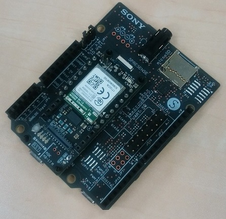

# GS2200-WiFi

[GS2200 WiFi add-on board](https://idy-design.com/product/is110b.html) operation

## Description

GS2200-WiFi is the sample program to kick GS2200 for the WiFi data transfer. SPRESENSE is expected to be the host controller.

## Features

- TCP Client : After connecting TCP server, it sends data on and on. [See the document.](./examples/TCPClient/Readme.txt)
- MQTT Publisher : After connecting MQTT broker, it sends data every 5 second. [See the document.](./Documents/GS2200_MQTT-001.pdf)
- Internet Radio : After connecting Internet radio server, it will play music at SPRESENSE analog output.
- HTTP Client : PC will run the HTTP server by Node.js, GS2200 will send POST/GET request to the HTTP server periodically.
- Limited-AP mode : GS2200 will be the WiFi AP and works as TCP echo server. PC will associate to GS2200 AP and connects to TCP server.
- Pass Through mode : You will send any AT commands via Serial.
- HTTP POST Test : You will send large data size of POST request.

## Requirement

- Arduino IDE 1.8.8
- Need to install <GS2200> library, otherwise you will have the compile error
- This web site will help you to install <GS2200> library. (http://stupiddog.jp/note/archives/266)

## Document
- Visit GS2200 AT Command Document (https://y1cj3stn5fbwhv73k0ipk1eg-wpengine.netdna-ssl.com/wp-content/uploads/2018/02/GS2200M-S2W-Adapter-Command-Reference-Guide_r3.0.pdf)

## Author

Norikazu Goto

## License

[LGPL](http://www.gnu.org/licenses/lgpl.html)

